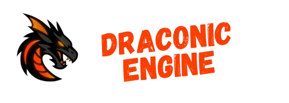

# Draconic Engine

  

**Draconic Engine is an open-source, multi-purpose game engine designed to bridge the gap between the accessibility of indie tools and the raw power required for AAA production. Built with a "performance-forward" & "modularity" philosophy, it provides a robust alternative to industry giants like Unreal, Unity, and Godot.**

> [!NOTE]
> The engine is still a W.I.P & so is this document. Help us out by adding new features or information!
